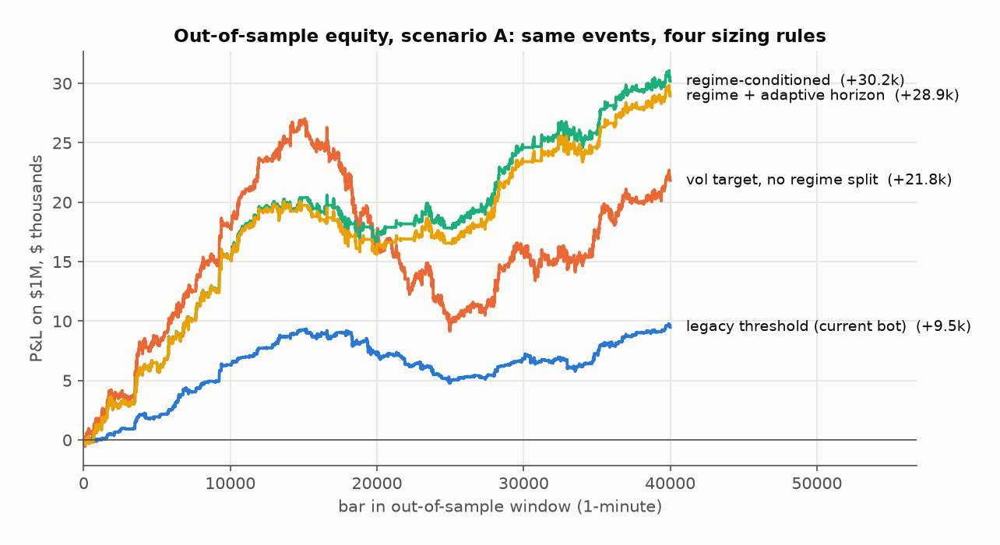
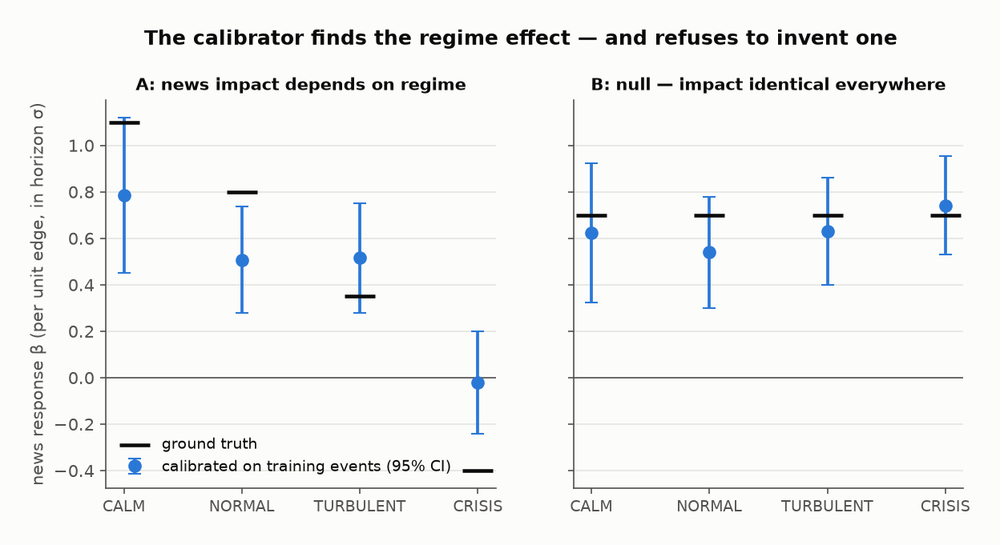
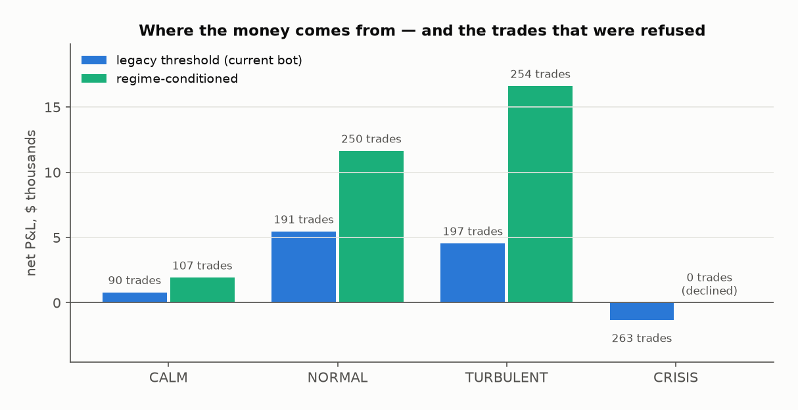
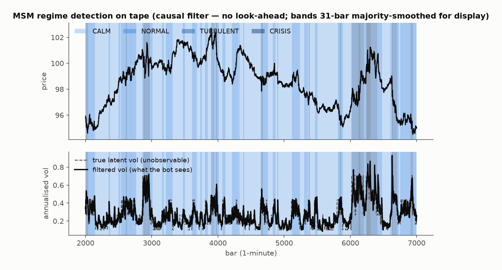
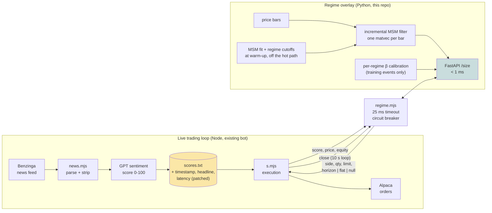
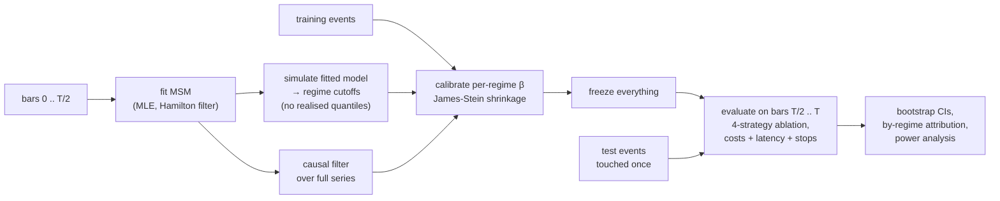
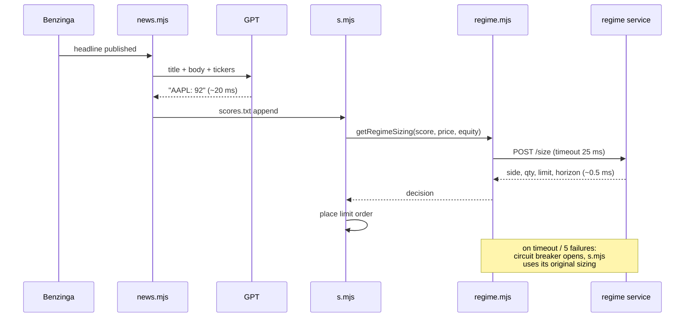

# Multifractal Time-GPT

**Volatility-regime conditioning for news-driven trading.** Markov-Switching
Multifractal (MSM) regime detection, fused with LLM news sentiment and
time-series foundation-model forecasts, with a low-latency service that plugs
into an existing execution bot.

---

## Project history

**July 2026 - Present** — Independent Quantitative Research

Developed through July 2026: MSM volatility-regime estimation with Hamilton
filtering and MLE calibration, fusion of per-regime news-response betas via
empirical-Bayes shrinkage, a walk-forward ablation backtester with
block-bootstrap confidence intervals, and a low-latency FastAPI regime service.

This repository was published to GitHub in August 2026. GitHub's repository
creation date reflects when the code was uploaded here, not when the work was
done.

---

## The question this answers

> Have you ever seen success combining regime detection (MSM / volatility
> states) with event-driven signals like news? Feels like there could be an edge
> in conditioning trades on regime rather than treating all news equally.

The short answer, from the synthetic validation in
[`docs/FINDINGS.md`](docs/FINDINGS.md): **yes, but not through the channel you'd
expect.**

Conditioning on regime improved out-of-sample Sharpe from **5.55 to 7.87** and
net P&L by **3.2x** — while placing **130 fewer trades**. Volatility targeting
on its own, without the regime split, actually made things *worse* (Sharpe
5.55 → 4.17). The entire gain came from the regime split identifying a bucket
where the news response was indistinguishable from zero, and **declining to
trade it at all**.

The edge was in the trades it refused, not in how it sized the ones it took.



And on a control scenario where news impact is identical across regimes, the
regime-conditioned strategy came within **0.09%** of the regime-agnostic one —
it found nothing, because there was nothing to find. That property is what makes
the first result worth believing.



Left: the calibrator recovers the regime-dependent response from training events
alone, including flagging CRISIS as having no reliable edge. Right: under the
null, all four estimates collapse onto the same value — no invented effect. The
P&L consequence, by regime:



---

## Install and see it work

```bash
pip install -e ".[all]"
```

```bash
python -m mtgpt.cli demo
```

No API keys, no market-data licence, no network. The demo builds two synthetic
markets — one where news impact genuinely depends on the volatility regime, one
where it does not — and runs the full walk-forward ablation on both. It prints
the recovered parameters, the out-of-sample comparison, per-regime attribution,
and how many more events you'd need for the difference to be statistically
resolvable.

```bash
python -m pytest        # 80 tests, ~60s
```

---

## Why MSM rather than GARCH

GARCH has one memory parameter, so volatility has one decay rate. Real tape does
not work that way: a Fed headline and a fat-finger print both raise volatility,
but one persists for days and the other for minutes.

MSM carries `K` volatility components at geometrically spaced time scales
simultaneously:

```
r_t     = sigma_t * eps_t
sigma_t = sigma_bar * sqrt(M_1t * M_2t * ... * M_Kt)
```

Each `M_k` flips between `{m0, 2-m0}` at its own frequency. Four parameters
describe the whole multiscale structure, and the per-component posteriors tell
you *which* scale is currently hot — the difference between a transient burst
and a structural shift, which is the difference between holding through a move
and getting out of it.

Multi-horizon forecasts are exact in closed form, so a position can be sized
against the volatility expected over its actual holding period rather than
against trailing realised vol.

This is what the filter sees on tape — regime bands from the causal filter only,
tracking a latent volatility it never observes directly:



---

## How the pieces fit together



If `regime.mjs` gets no answer inside its timeout, `s.mjs` falls back to its
original sizing — the overlay can decline a trade, but it can never halt the bot.

The research loop that produced the numbers above is walk-forward end to end:



---

## What's in here

```
mtgpt/
  models/
    msm.py           MSM: Hamilton filter, MLE, exact h-step forecasts
    regimes.py       regime classification, survival, scale decomposition
    mfdfa.py         MF-DFA multifractality test (is MSM even warranted?)
    foundation.py    TimeGPT adapter + offline Theta/random-walk baselines
  signals/
    news.py          event tape, score -> edge, dedup, staleness decay
    fusion.py        regime x news sizing, empirical-Bayes calibration
  backtest/
    engine.py        walk-forward event backtester, 4-way ablation
    metrics.py       bootstrap CIs, per-regime attribution
  service/           FastAPI regime service (sub-ms sizing)
  data/              Alpaca/CSV loaders, synthetic generator with known truth
integration/
  hft-node-bot/      drop-in patch for the existing Node HFT bot
scripts/
  make_figures.py    regenerates every figure above from real pipeline runs
docs/
  METHOD.md          the maths and the design decisions
  FINDINGS.md        results, caveats, and what to do next
  img/               the README figures (reproducible, seed 7)
```

---

## The commands

```bash
python -m mtgpt.cli fit --symbol AAPL --select-k
```
Estimate MSM parameters and sweep `K` by BIC. Prints the time scale of each
volatility component in bars.

```bash
python -m mtgpt.cli diagnose --symbol TSLA
```
MF-DFA test for whether the asset is multifractal enough for MSM to help,
benchmarked against the same series shuffled. If `h(q)` is flat, MSM collapses
toward a one-factor volatility model — better to know before you build on it.

```bash
python -m mtgpt.cli backtest --symbol AAPL --events scores.csv
```
Walk-forward ablation on a real event tape.

```bash
python -m mtgpt.cli forecast-bench --symbol AAPL
```
TimeGPT against the offline baselines, on MASE and directional accuracy.

```bash
python -m mtgpt.cli serve
```
Start the regime service.

---

## Wiring it into the existing bot

[`integration/hft-node-bot/`](integration/hft-node-bot/) patches
[the news-sentiment HFT bot](https://github.com/crollila/High-Frequency-Trading-Algorithm-with-Instant-News-Sentiment-Analysis)
so every news trade is sized against a live regime estimate.
`patched/` holds complete, ready-to-diff copies of `s.mjs` and `news.mjs`;
`README.md` there explains each change.

| | before | after |
|---|---|---|
| Size | `equity/500 × bucket(score)` | `risk_budget × equity / σ_horizon` |
| Entry | hard cutoffs at 70/45/30 | continuous edge, per-regime gate |
| Crisis news | traded like any other | declined on calibrated evidence |
| `scores.txt` | `id, TICKER, score` | adds ISO timestamp, headline, latency |

**Measured end-to-end**: sizing responds in **330–820µs**. The MSM fit and the
regime-cutoff simulation happen at start-up; a new bar costs one matrix-vector
product; the request path is a handful of cached dot products.



**It fails open.** If the service is slow or down, the bot falls back to exactly
the sizing it uses today. A circuit breaker opens after five failures — eight
calls against a dead service cost **1ms total**, not eight timeouts. An overlay
that can halt trading is a worse risk than the one it removes.

### The `scores.txt` change matters most

The current log format has no timestamp, so a signal cannot be joined to a
price, so **none of the existing score history can be used to measure
anything**. Fixing it is ten lines of JavaScript and it is the prerequisite for
every other question here. The Python parser reads both formats, so no
historical lines are lost.

---

## How this avoids fooling itself

Backtests that condition on regime are unusually easy to get wrong, so the
guardrails are the point:

- **Regime cutoffs never touch realised prices.** They come from simulating the
  fitted model. Sample quantiles of the realised series would leak the future
  into every historical label.
- **The calibrator can return "no effect".** Per-regime betas are shrunk toward
  the pooled estimate with a James-Stein weight driven by the *estimated
  between-regime variance*. If the spread between regimes is no bigger than
  estimation noise, all four betas collapse to one number. A test pins this.
- **The null scenario is shipped, not hypothetical.** `flat_response()` generates
  a market where regime is irrelevant, and the pipeline correctly reports no
  gain.
- **Shuffled scores must kill the edge.** A test detaches scores from their
  events and requires the measured response to go insignificant. A look-ahead
  bug would still find an edge in scrambled data.
- **The ablation attributes the gain.** Four strategies on identical events, so
  a result belongs to a specific mechanism. This is how the "vol targeting
  alone makes it worse" finding surfaced instead of being buried.
- **Error bars on everything.** Block-bootstrap Sharpe intervals (positions span
  bars, so returns are autocorrelated and i.i.d. resampling would lie), and a
  power analysis that says how much more data you need.

The headline improvement in `FINDINGS.md` is **not** statistically significant
on per-trade returns at n ≈ 600. That is stated there rather than hidden, along
with the finding that the concentration cap binds on 83% of trades and partially
disables the vol targeting.

---

## Status

Research code, validated on synthetic data where the answer is known. The
synthetic results demonstrate the machinery is sound; they are **not** evidence
about real markets. Nothing here has traded real money, and the real-data
question stays open until there is a timestamped event tape of a few thousand
scored headlines to run it on.

## References

Calvet & Fisher (2004), *How to Forecast Long-Run Volatility*, J. Financial
Econometrics 2(1) · Kantelhardt et al. (2002), *Multifractal DFA*, Physica A 316
· Assimakopoulos & Nikolopoulos (2000), *The theta model*, IJF 16(4) · Politis &
Romano (1994), *The Stationary Bootstrap*, JASA 89(428). Full list in
[`docs/METHOD.md`](docs/METHOD.md).

## License

MIT.
